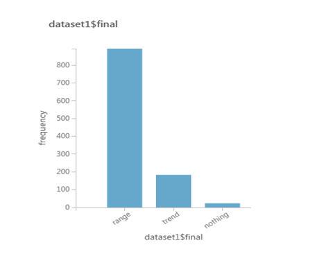

## Description
High-frequency trading system with scope on CME's WTI. 

## Tools
- Interactive Brokers Gateway and IBPY (wrapper for API calls( https://github.com/blampe/IbPy)
- Microsoft's Machine Learning cloud-based solution, called through REST API. 
- concurrent.Futures for concurrency
- plot.ly for stream strategy execution to a remote charting display

## Sample of trade execution and indicators

## Distribution of Out-of-sample results

## Testing
It has been tested on a AWS server running Ubuntu. 
